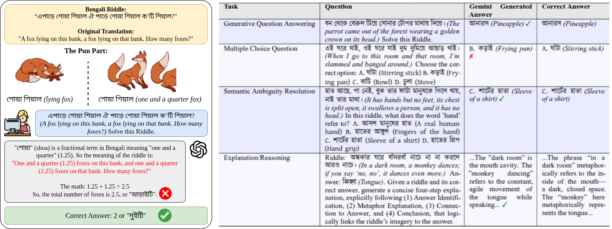

# _Can LLMs Solve My Grandma’s Enigmas?_ Evaluating Multilingual Large Language Models on Reasoning Traditional Bangla Tricky Riddles

_Abstract: Large Language Models (LLMs) show impressive performance on many NLP benchmarks, yet their ability to reason in figurative, culturally grounded, and low-resource settings remains underexplored. We address this gap for Bangla by introducing **BanglaRiddleEval**, a benchmark of 1,244 traditional Bangla riddles instantiated across four tasks (4,976 riddle--task artifacts in total). Using an LLM-based pipeline, we generate Chain-of-Thought explanations, semantically coherent distractors, and fine-grained ambiguity annotations, and evaluate a diverse suite of open-source and closed-source models under different prompting strategies. Models achieve moderate semantic overlap on generative QA but low correctness, MCQ accuracy peaks at only about 56% versus an 83% human baseline, and ambiguity resolution ranges from roughly 26% to 68%, with high-quality explanations confined to the strongest models. These results show that current LLMs capture some cues needed for Bangla riddle reasoning but remain far from human-level performance, establishing **BanglaRiddleEval** as a challenging new benchmark for low-resource figurative reasoning._

<p align="center">
  
</p>

Figure: **(Left)** Example of Bangla riddle from _BanglaRiddleEval_. The homophone "শোয়া শিয়াল" ("lying fox" vs. "one-and-a-quarter fox") tricks LLM into answering 2.5 foxes, while the correct answer is 2, illustrating the challenge of traditional Bengali riddle reasoning. **(Right)** Task overview of _BanglaRiddleEval_. Question, LLM-generated answer, and ground truth answer for four Bangla riddle tasks. Green ticks (✅) and red crosses (❌) indicate correctness of the generated answers.

---

## 🚀 Getting Started

### Prerequisites

- **Python**: 3.8 or higher
<!-- - **Ollama**: For running local open-source models (Qwen3, GPT-OSS, Gemma, Deepseek-r1) -->
- **Google Gemini API Key**: For running Gemini models (optional)

### Installation

1. **Clone the repository**
```bash
git clone https://github.com/Labib1610/BanglaRiddleEval.git
cd BanglaRiddleEval
```

2. **Install Python dependencies**
```bash
pip install -r requirements.txt
```

<!-- 3. **Install Ollama** (for local models)
```bash
# On Linux
curl -fsSL https://ollama.com/install.sh | sh

# On macOS
brew install ollama

# On Windows
# Download from https://ollama.com/download
```

4. **Pull required Ollama models** (optional - only if evaluating local models)
```bash
ollama pull qwen3:4b
ollama pull qwen3:8b
ollama pull qwen3:14b
ollama pull gpt-oss:20b
ollama pull gemma3:4b
ollama pull gemma3:12b
ollama pull deepseek-r1:7b
ollama pull deepseek-r1:14b
```
-->

### Dataset Structure

The benchmark contains 1,244 Bengali riddles with four task instantiations:

```
Data/
├── riddles.json                      # Base riddles with answers (1,244 items)
├── riddles_reasoning.json            # Riddles with CoT reasoning (1,244 items)
├── riddles_mcq.json                  # Multiple choice questions (1,244 items)
└── riddles_semantic_ambiguity.json   # Semantic classification (1,244 items)
```

---

## 📊 Evaluation Tasks

### 1. **Generative Question Answering**
Direct answer generation for riddles.
- **Input**: Riddle text
- **Output**: Generated answer

### 2. **Reasoning Evaluation (CoT)**
Chain-of-thought reasoning with step-by-step explanation.
- **Input**: Riddle + CoT reasoning
- **Output**: Final answer with reasoning steps

### 3. **Discriminative Evaluation (MCQ)**
Multiple choice question answering with 4 options.
- **Input**: Riddle + 4 answer choices
- **Output**: Selected option index

### 4. **Classification (Semantic Ambiguity)**
Identifying semantic ambiguity in riddle terms.
- **Input**: Riddle + ambiguous word + context
- **Output**: Classification of ambiguity type

---

## 🔬 Running Evaluations

### Evaluate Models

Navigate to any model directory and run:

```bash
# Example: Qwen3 4B on generative task
cd "Code/Model Evaluation/generative evaluation/Qwen3/qwen3:4b"
python run_evaluation.py

# Example: GPT-OSS 20B on MCQ task
cd "Code/Model Evaluation/discriminative evaluation/gpt-oss:20b"
python run_evaluation.py
```

### Evaluate with Google Gemini API

1. **Add your API key** to the model script:
```python
# Edit the KEY_LIST in the script
KEY_LIST = [
    "your-api-key-here",
    # Add more keys for rate limit handling
]
```

2. **Run evaluation**:
```bash
cd "Code/Model Evaluation/generative evaluation/Gemini-flash"
python run_evaluation.py
```

### Supported Models

**Open-Source:**
- Qwen3 (4B, 8B, 14B)
- GPT-OSS (20B)
- Gemma3 (4B, 12B)
- Deepseek-r1 (7B, 14B)

**Closed-Source:**
- Google Gemini 2.5 Flash

---

## 🛠️ Synthetic Data Generation

The benchmark includes scripts for generating evaluation artifacts:

### 1. Chain-of-Thought (CoT) Generation
```bash
cd "Code/Synthetic Data Generation/cot maker"
python run_cot_generation.py
```
Generates step-by-step reasoning for riddles using gpt-oss:20b.

### 2. Multiple Choice Questions
```bash
cd "Code/Synthetic Data Generation/mcq maker"
python run_mcq_generation.py
```
Creates MCQ options with semantic distractors.

### 3. Semantic Ambiguity Annotations
```bash
cd "Code/Synthetic Data Generation/semantic_ambiguity"
python run_semantic_generation.py
```
Identifies and classifies semantic ambiguities in riddles.

---

## 📁 Code Structure

```
Code/
├── Model Evaluation/
│   ├── generative evaluation/        # Direct answer generation
│   │   ├── Qwen3/
│   │   ├── gpt-oss:20b/
│   │   ├── Gemini-flash/
│   │   └── ...
│   ├── reasoning evaluation/         # CoT reasoning tasks
│   │   ├── Qwen3/
│   │   ├── Gemini-flash-lite/
│   │   └── ...
│   ├── discriminative evaluation/    # MCQ tasks
│   │   ├── Qwen3/
│   │   ├── gpt-oss:20b/
│   │   └── ...
│   └── classification evaluation/    # Semantic ambiguity
│       ├── Gemini-flash/
│       └── ...
└── Synthetic Data Generation/
    ├── cot maker/                    # CoT generation
    ├── mcq maker/                    # MCQ generation
    └── semantic_ambiguity/           # Ambiguity annotation
```

---

## 📋 Requirements

See `requirements.txt` for full dependencies:
- `tqdm` - Progress bars
- `requests` - HTTP requests for Ollama
<!-- - `ollama` - Ollama Python client -->
- `google-generativeai` - Google Gemini API
- `bert-score` - BERTScore evaluation
- `torch` - PyTorch for BERTScore
- `transformers` - Hugging Face transformers

---

## 🎯 Prompting Strategies

All evaluation scripts support three prompting modes:

1. **Zero-shot**: Direct instruction without examples
2. **Few-shot**: 2-3 example riddle-answer pairs as context
3. **Chain-of-Thought (CoT)**: Step-by-step reasoning prompts

Configure in each model's script or use default settings.

<!---

## 📄 Citation

If you use BanglaRiddleEval in your research, please cite:

```bibtex
@article{banglariddleeval2025,
  title={Can LLMs Solve My Grandma's Enigmas? Evaluating Multilingual Large Language Models on Reasoning Traditional Bangla Tricky Riddles},
  author={[Authors]},
  journal={[Journal/Conference]},
  year={2025}
}
```

---

## 📧 Contact

For questions or issues, please open a GitHub issue or contact the authors.

---

## 📜 License

This project is licensed under the MIT License - see the LICENSE file for details. -->
